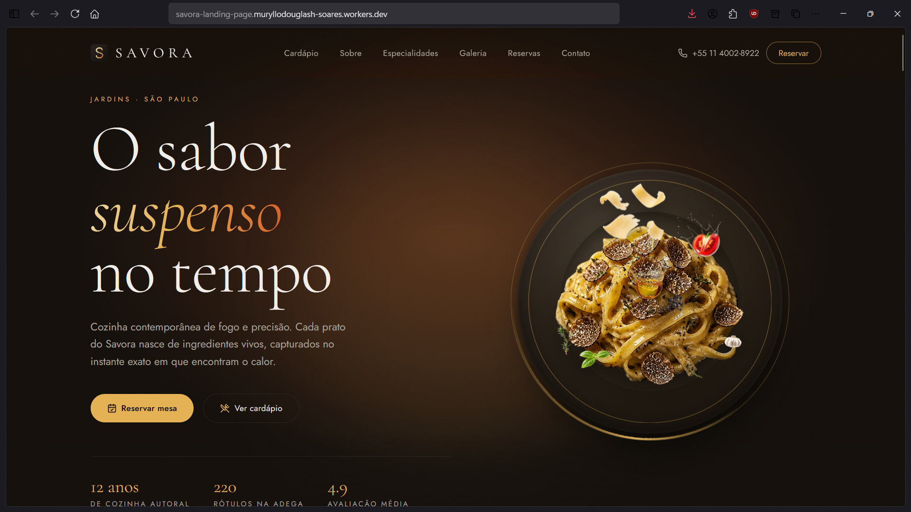
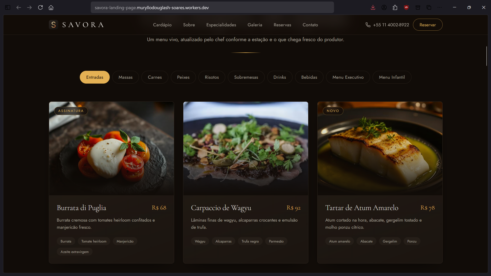
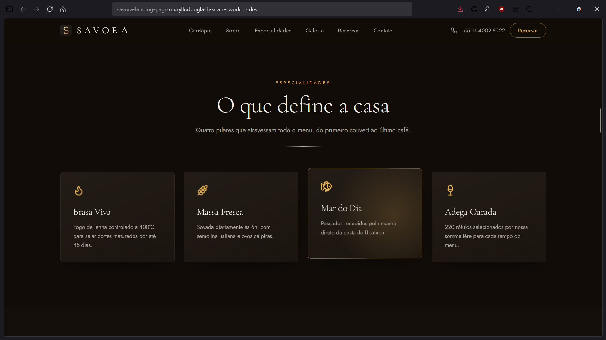
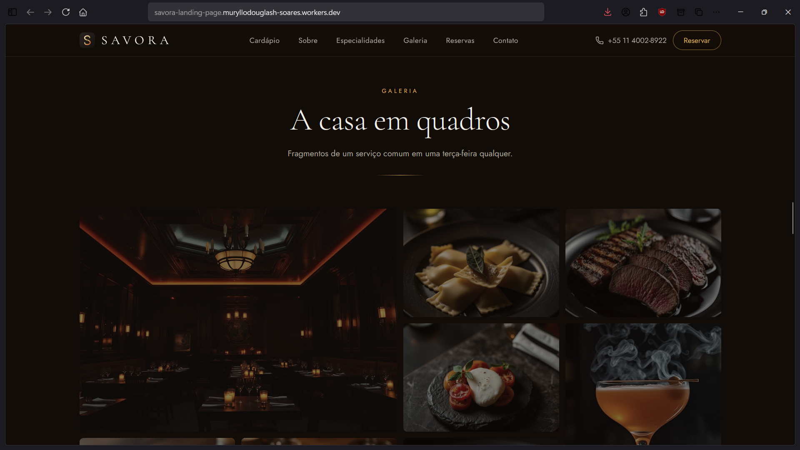
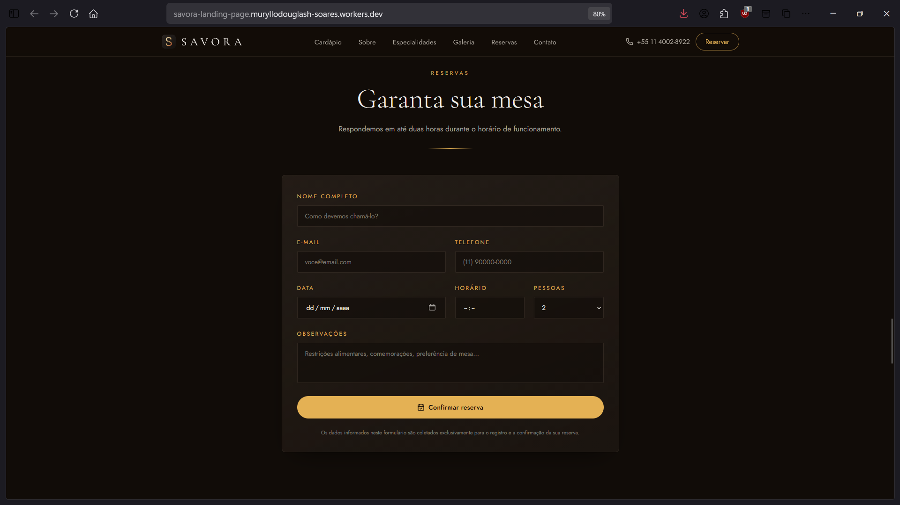
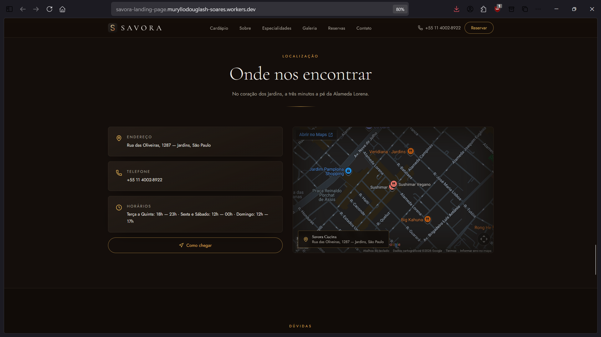
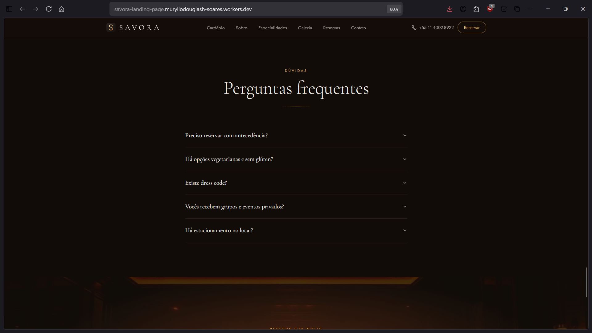
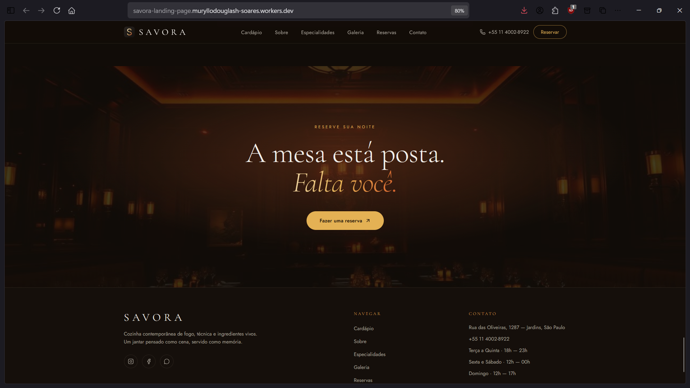

# Savora — Landing Page

> Landing page premium para o Savora, um restaurante contemporâneo fictício, com cardápio digital, animação autoral na hero e reservas integradas de ponta a ponta.

> Todos os dados do restaurante (nome, endereço, telefone, chef, depoimentos) são fictícios, construídos para servir como peça de portfólio.

## 🌐 Demo

https://savora-landing-page.muryllodouglash-soares.workers.dev/

## 📸 Preview

<table>
  <tr>
    <td></td>
    <td></td>
  </tr>
  <tr>
    <td align="center"><sub>Página principal</sub></td>
    <td align="center"><sub>Cardápio digital</sub></td>
  </tr>
  <tr>
    <td></td>
    <td></td>
  </tr>
  <tr>
    <td align="center"><sub>Informações</sub></td>
    <td align="center"><sub>Galeria</sub></td>
  </tr>
  <tr>
    <td></td>
    <td></td>
  </tr>
  <tr>
    <td align="center"><sub>Reservas</sub></td>
    <td align="center"><sub>Localização</sub></td>
  </tr>
  <tr>
    <td></td>
    <td></td>
  </tr>
  <tr>
    <td align="center"><sub>Perguntas frequentes</sub></td>
    <td align="center"><sub>CTA final</sub></td>
  </tr>
</table>

## Sobre o projeto

Site institucional com cardápio digital, seções de apresentação do restaurante, mapa de localização e um formulário de reservas com automação real ponta a ponta via Make. Construído como peça de portfólio, com foco em animação de alto padrão (a montagem do prato na hero) e performance.

## Funcionalidades

- [x] Landing page completa (hero, sobre, especialidades, ingredientes, galeria, avaliações, localização, FAQ, CTA)
- [x] Cardápio digital com itens organizados por categoria (imagem, nome, descrição, preço, ingredientes e tag opcional)
- [x] Animação autoral na Hero: montagem do prato (ingredientes caindo, brilho, auréola contínua), com fallback estático para `prefers-reduced-motion`
- [x] Localização via embed real do Google Maps (sem necessidade de API key), com filtro visual combinando com o tema
- [x] Formulário de reservas integrado de ponta a ponta: validação client-side (React Hook Form) → server function do TanStack Start → webhook do Make → planilha do Google Sheets → geração periódica de relatório em PDF (template HTML/Handlebars incluído)

## Tecnologias

### Frontend

- React 19 + TypeScript
- TanStack Start (SSR) + TanStack Router
- Vite
- Tailwind CSS 4
- Motion (Framer Motion) para animações
- shadcn/ui + Radix UI (apenas `accordion` e `sonner` estão de fato em uso)
- React Hook Form (formulário de reservas)

### Ferramentas

- ESLint + Prettier
- Cloudflare Workers (deploy) + Make (automação de reservas)

## Design e UX — a Hero Section

A Hero simula um chef montando o prato: primeiro o prato de cerâmica é posto na mesa, depois os ingredientes caem sobre ele um a um — com leve rotação e bounce ao pousar —, seguidos por um brilho final e uma polvilhada de tempero. Essa sequência roda uma única vez ao carregar a página; depois disso, a única animação contínua é uma auréola dourada ao redor do prato (glow ambiente + arco em gradiente girando).

A lógica é dividida em componentes pequenos em `src/components/hero/`:

| Componente | Responsabilidade |
|---|---|
| `Hero.tsx` | Orquestra a seção: copy, botões, parallax de scroll e tilt do mouse |
| `PlateAnimation.tsx` | Sequencia a montagem do prato |
| `Plate.tsx` | O prato de cerâmica (gradientes CSS, sem imagem) |
| `PlateRing.tsx` | Auréola dourada contínua, em loop infinito |
| `Ingredient.tsx` | Uma peça caindo: queda, rotação, bounce e acomodação |
| `ShineEffect.tsx` | Brilho único ao final da montagem |
| `SeasoningParticles.tsx` | Rajada curta e finita de partículas de tempero |

**Decisões de performance** (a versão anterior ao Lovable usava dezenas de animações em loop infinito e filtros de blur pesados):

- A sequência de montagem anima apenas `transform` e `opacity` e roda uma única vez — nada usa `repeat: Infinity`, exceto a auréola do prato, cujas duas animações são leves e compostas na GPU.
- `will-change` é aplicado só enquanto uma peça está caindo e removido ao se acomodar.
- Respeita `prefers-reduced-motion`: quando ativado, o prato já aparece pronto, sem sequência de montagem.
- No mobile, a sequência usa menos peças, timeline mais rápida e menos partículas.
- Apenas a imagem principal do prato (`hero-dish.webp`) é pré-carregada; as demais carregam sob demanda (`loading="lazy"`).

## Responsividade

A hero e o cardápio adaptam a quantidade de elementos e a velocidade das animações conforme o viewport (ver seção de performance acima).

## Como executar

### Pré-requisitos

- Node.js e npm (também compatível com Bun — rode `bun install` para gerar o `bun.lock`)

### Instalação

```bash
git clone <URL-do-repositorio>
cd savora-landing-page
npm install
npm run dev
```

Outros scripts disponíveis:

```bash
npm run build       # build de produção
npm run build:dev   # build em modo development
npm run preview      # serve o build de produção localmente
npm run lint          # ESLint
npm run format        # Prettier (--write)
```

### Configuração de ambiente

O formulário de reservas depende de uma variável de servidor (não pública):

| Variável | Onde é lida | Onde configurar |
|---|---|---|
| `MAKE_WEBHOOK_URL` | `src/lib/reservation-fn.ts`, só no servidor | Local: copie `.dev.vars.example` para `.dev.vars`. Produção: `npx wrangler secret put MAKE_WEBHOOK_URL` ou pelo dashboard da Cloudflare, como Secret |

Por ser lida apenas no `process.env` do lado do servidor (sem prefixo `VITE_`), essa URL nunca é embutida no bundle JS enviado ao navegador.

## Estrutura do projeto

```
src/
├── assets/            # imagens (pratos, ingredientes, galeria) — .webp otimizado
├── components/
│   ├── common/         # componentes compartilhados (ex.: MagneticLink)
│   ├── hero/            # Hero e a animação de montagem do prato
│   ├── layout/           # Navbar, Footer
│   ├── menu/              # Cardápio digital (cards, filtros por categoria)
│   ├── sections/           # Sobre, Especialidades, Ingredientes, Galeria, Avaliações,
│   │                       # Reservas, Localização, FAQ, CTA final
│   └── ui/                  # primitivos shadcn/ui — só os 2 realmente usados
├── data/                # dados do cardápio e do restaurante (menu.ts, site.ts)
├── hooks/               # hooks utilitários (ex.: use-mobile)
├── lib/                  # sistema de motion compartilhado, utils, error reporting,
│                          # server function de reservas (reservation-fn.ts)
└── routes/               # rotas do TanStack Router (__root, index)

docs-relatorio-reservas.html  # template HTML/Handlebars do PDF de relatório de
                                # reservas, usado no cenário do Make
```

## Decisões técnicas

### Reservas: formulário → Make → planilha → PDF

1. O usuário preenche e envia o formulário (React Hook Form valida).
2. O front-end chama `submitReservation`, uma server function do TanStack Start (`src/lib/reservation-fn.ts`) — o código roda dentro do Cloudflare Worker, nunca no navegador.
3. A server function repassa os dados via `POST` para um Custom Webhook do Make, cuja URL vive apenas em `MAKE_WEBHOOK_URL` (secret do Worker) — o cliente nunca acessa essa URL.
4. No Make, o cenário grava cada reserva em uma planilha do Google Sheets e pode gerar um relatório periódico em PDF a partir do template `docs-relatorio-reservas.html`.

### Limpeza de scaffold (shadcn)

O projeto veio do Lovable com o scaffold completo do shadcn/ui (~45 componentes prontos). Apenas dois — `accordion` (FAQ) e `sonner` (toast de confirmação) — chegaram a ser usados de verdade. Numa revisão final, o restante foi removido: arquivos de componente, ~25 pacotes de dependências (várias libs Radix, `recharts`, `cmdk`, `embla-carousel-react`, `react-day-picker`, `vaul`, `zod`, `date-fns`, entre outras) e tokens de CSS que só existiam para sustentá-los. Também foram removidas as imagens `.png` originais (mantendo só as versões `.webp`, já usadas em todo o código), retirando mais de 2 MB do repositório. `npm install` passou a trazer ~115 pacotes a menos, e `src/components/ui/` foi de 45 arquivos para 2.

## Deploy

Publicado em Cloudflare Workers, com o secret `MAKE_WEBHOOK_URL` configurado via Wrangler ou pelo dashboard da Cloudflare.

## Autor

Muryllo Douglas — projeto iniciado no [Lovable](https://lovable.dev) e evoluído manualmente.

## Licença

Ver [`LICENSE`](./LICENSE).
